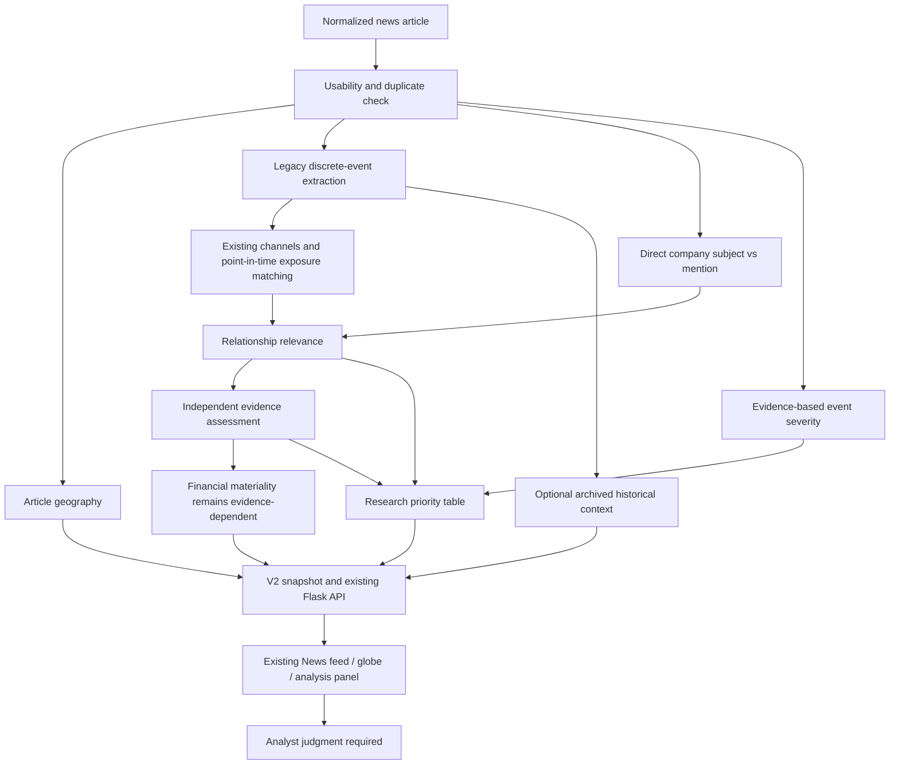

# Research Intelligence V2 — implementation and validation

## Product scope

News is now a research-intelligence input, not a trading-signal filter. A usable article is retained even when the legacy discrete-event detector finds no qualifying action. Company relevance, event severity, evidence, financial materiality and analyst attention are separate fields. All generated direction remains **Analyst judgment required**. No Buy/Sell, bullish/bearish, expected-return or stock-rise probability conclusion is produced.

## Before-change audit

V1 `research_intelligence.analyze_article` returned immediately after a negative Event Gate decision. Thus company commentary and its geography could never reach relationships. V1 relationship score used direct mention .15 plus edge .30, country .15 and channel .15 (the existing WEIGHTS). Priority was High for verified exposure, Medium for partial/direct subject, otherwise Review. Materiality was Unknown/unquantified. Historical ML entered through `historical_context.context_for` as optional archived context. Event geography depended on accepted extraction; the UI plotted only accepted events with coordinates. The integrated UI showed raw numerical relevance prominently and no coordinates were present in the live snapshot.

The implementation preserves the tested V1 functions and archives, introduces a versioned research orchestration entrypoint, and activates the V2 snapshot in the existing Flask/UI integration. No provider fetching is duplicated.

## Changed/new files and responsibilities

- NEW `src/news/research_v2.py`: active V2 batch builder/CLI; usable-content classification, company-subject links independent of discrete gate, reuse of legacy event/exposure results, independent assessments, queue and backward-compatible fields.
- NEW `src/news/research_policy.py`: transparent severity rule list, ordinal policy scores and configurable attention table. No returns, models or outcomes are inputs.
- NEW `src/news/event_geography.py`: article-only location evidence and coarse country visualization points from existing map data, independent of ticker matches.
- `src/news/ui_api.py`: V2 serialization and explicit default V2 current snapshot; V1 snapshots remain supported as `news_ui_v1`.
- `static/js/news_model.js`: V1/V2 adapter, human relevance level, severity-based marker category and global article geography.
- `static/js/news_ui.js`: human relevance/severity score-cell labels, independent financial-impact/evidence/priority/context fields, secondary policy score disclosure and all usable located articles as marker candidates.
- `static/js/news_globe.js`: ONLY two hardcoded DEMO tooltip suffixes replaced with backend coordinate precision. Rendering, geometry, colors, animation and interaction mechanics unchanged.
- `templates/news.html`: ONLY marker legend text updated to Critical / High, Medium, Low / Unknown. No structure or stylesheet changes.
- NEW `tests/news/test_research_v2.py`: 19 V2 regression methods.
- `tests/news_model_test.mjs`: additional V2 adapter/UI semantic assertions; previous adapter tests retained.
- NEW `data/news/research/news_research_v2_current.json`: regenerated research output from the existing normalized 21 real articles; original V1 outputs untouched.
- New documentation, semantic QA results, screenshots and integrity/test logs in `docs/v2/`.

Every other copied original file matches its pre-edit SHA-256. In particular: `app.py`, all Research Mode routes/templates/logic, all CSS, financial services/models, valuation, ratings, Earnings Quality, SEC, Moats, Event Gate, Event Extractor, Channel Generator, Exposure Matcher, constants/weights, exposure workbook, `research_intelligence.py`, historical context implementation and all historical ML source/data/models/labels/validation are unchanged.

## Architecture



Historical context has no arrow into relevance, severity, materiality or priority.

## Event Gate semantics and compatibility

The legacy gate is unchanged and now means **is there a supported discrete event for legacy extraction/matching?**, not **should the article disappear?**. Its result remains under `gate` for audit. V2 also returns `usable`, `classification` and a non-rejection `status` such as actionable_event, low_severity_event, commentary, opinion, macro_event, geopolitical_event or general_news.

Malformed/no-substantive-body input and repeated article IDs are unusable; they get no relationships or marker. A minimal substantive-body check is a headline over five characters and body of at least six words, plus a small navigation-only check; it is not a full content-quality classifier. V1 input identity/exposure safeguards remain in V1; V2 additionally requires unique nonempty exposure edge IDs. Missing article availability cannot create a qualified direct subject. Explicit older years, historical framing, hypothetical and negated action wording are excluded from new direct-action/severity evidence.

V1 `python3 -m src.news.research_intelligence` remains the legacy CLI for reproducibility. The new active producer is `python3 -m src.news.research_v2`. Existing callers of V1 Python functions are not silently changed. The website defaults to an explicitly generated V2 file; old files are not silently converted without their source articles.

## Relationship relevance

Human levels are independent of severity:

- **High**: explicit direct event/company subject, or a qualified existing verified exposure edge.
- **Medium**: existing qualified partial exposure edge.
- **Mention only**: company name without a qualified subject/action link or eligible exposure.
- **None**: article has no watchlist relationship; no fake ticker row is created.
- **Low** is supported by the priority policy but is not assigned without a defensible weak-relationship category.

The original numerical relationship score is retained as `relevance.relationship_score`, with its original V1 components for existing matches. New mention/direct-company rows use the existing direct-mention weight; no severity bonus is added. A direct subject may still have .15 internally while human relevance is High. This is intentional: the old number measures legacy components, not the new ordinal label or a probability.

New subject rules recognize bounded company-led workforce actions and company/CEO/boss speech. They supplement existing legal, recall, pricing and export-action subjects. A roundup (“Nvidia, CPI, Oil ... in Focus”), comparison or hypothetical stays mention-only. No alias-specific ticker branches or future price data decide these results.

## Severity model

`severity = {level, score, components, reason, method, interpretation}`. The maximum supported rule wins; every matching component includes source field and article clause. This is an ordinal policy, not a learned model or probability:

| Level | Score | Supported policy evidence |
| --- | ---: | --- |
| Critical | 1.0 | Explicit nationwide/countrywide complete shutdown, total outage or evacuation |
| High | .8 | Major/complete fab or production halt; explicit government/regulator export prohibition; widespread/prolonged operational disruption |
| Medium | .5 | Explicit production/packaging/oil shipment/power/service disruption; announced export restriction; reported workforce reduction |
| Low | .2 | Classified company commentary/opinion/product discussion with no supported operational or binding-action escalation |
| Unknown | null | No rule establishes scale |

No assumption that Unknown means harmless. Forecasts, proposals, discussion of a possible disruption, negation and explicit historical references do not establish observed disruption severity. The policy is deliberately bounded; not all event families currently have scale rules. No revenue amount, duration or customer impact is invented.

## Evidence and financial materiality

`evidence_assessment` is independent: Strong for an already qualified verified curated edge, Moderate for an explicit company subject, Partial for eligible partial exposure, Mention only otherwise. Original `evidence_strength`, source snippets and edge records are preserved for detailed audit. Direct article evidence is not independent confirmation; a curated relationship is not proof of this event's financial impact.

`financial_materiality` is the V2 display assessment. Mention-only candidates receive **Insufficient evidence**; supported company/exposure relationships remain **Not yet quantified** without validated event-specific financial exposure. The legacy materiality object remains available. Severity High and workbook exposure_band High do not become Quantified High. This release does not invent a quantitative materiality grading engine; no current source output establishes validated company-specific numerator/denominator evidence for it.

## Research priority

The configurable `PRIORITY_TABLE` maps relevance × severity, followed by an evidence safeguard:

| Relevance | Low severity | Medium | High | Critical | Unknown |
| --- | --- | --- | --- | --- | --- |
| High | Low | Medium | High | Urgent | Review |
| Medium | Low | Medium | High | High | Review |
| Low / None | Low | Review | Review | Review | Review |
| Mention only | Review | Review | Review | Review | Review |

Weak/Mention-only/Unavailable evidence caps High/Urgent at Review. Policy scores are Low .2, Medium .5, High .8, Urgent 1.0, Review null. These values are analyst-attention labels, not impact magnitudes. Queue sorting is priority then stable article/ticker identity. No ML, market returns or direction is used. Financial materiality does not numerically boost priority while it is unquantified.

## Geography and globe

Extraction is attempted for every usable article, regardless of discrete-event acceptance or ticker matches. It reads headline/summary/body clauses, not publisher, publisher country, raw metadata countries, or assumed corporate headquarters. Recognized country/location framing must be at the start of the headline or after an explicit locative such as in/near/off/across. Multiple competing countries remain unresolved rather than selecting one arbitrarily. Known city/region mappings remain coarse and bounded.

Fields: event_country, event_region, event_city, latitude, longitude, location_basis, location_confidence, coordinate_basis, coordinate_precision, and source evidence. Unknown remains null/unresolved.

Country plotting uses the existing Natural Earth `LABEL_X` / `LABEL_Y` cartographic reference points, matched to the supported country. These are **country representative points, not exact incident coordinates or mathematically computed centroids**. They implement the requested safe coarse country placement using existing local data. `coordinate_precision=country_approximation` is exposed in the panel/tooltip. They never feed back into exposure matching. Unresolved countries receive no marker.

Markers reuse existing red/amber/gray styles for Critical/High, Medium, Low/Unknown. A marker without a ticker still opens its article. Existing globe behavior is preserved apart from truthful tooltip text.

## Historical context

Existing B1/B2a/B2b models, QQQ-relative horizons/thresholds and expanding-window artifacts are preserved. `historical_context` exposes availability, a retrospective-only disclosure and the original validated archived details when available. It does not fabricate a comparable sample size or observed frequency, reinterpret model probability as a stock-rise probability, or invent a historical summary when none exists. Commentary without a compatible archived event binding remains unavailable. Extremal mocked historical probabilities and added future-return fields are tested not to change relevance, severity, priority, materiality or direction.

## API and frontend contract

`GET /api/news/intelligence` remains unchanged as a route. A configured V2 snapshot yields `schema_version=news_ui_v2`, generated_at, summary, queue and articles. Existing V1 files still serialize as news_ui_v1. V2 carries geography/severity/classification plus original ticker fields and new relevance/evidence_assessment/financial_materiality/historical_context objects. Existing evidence arrays remain arrays for compatibility.

`NEWS_INTELLIGENCE_OUTPUT_PATH` now defaults to `data/news/research/news_research_v2_current.json`. No arbitrary latest-QA-file selection and no provider call on page load. The UI displays human relevance and severity in the existing two score cells; original numeric relationship score appears only in a secondary explanation. Feed remains one row per article, with all ticker analyses preserved. General news uses non-rejection classification; only unusable content is labeled unusable. Missing data is not replaced by demo values.

## QA and validation

Real input: the unchanged 21-article normalized batch. V2 results: **21 usable, 4 legacy discrete events, 0 unusable rejections, 1 qualified relationship, 0 review candidates**. NVDA CEO commentary is now High relevance / Low severity / Low priority, Direct article evidence, financial impact Not yet quantified. Location remains Unknown rather than BBC → UK. Ten articles have supported country-level map points; none gain ticker exposure from geography alone.

Specified cases A–F are also tested with the exact/representative supplied headlines and explicitly controlled supporting bodies (not falsely claimed as newly fetched full articles):

| Case | Result |
| --- | --- |
| A Apple job cuts | AAPL direct_event_subject; High relevance; Medium severity/priority; Not yet quantified |
| B Apple Fitness+ layoffs | AAPL direct_event_subject; High relevance; Medium severity/priority; Not yet quantified |
| C Nvidia CEO comments | NVDA direct_company_subject; High relevance; Low severity/priority |
| D Nvidia/CPI/oil roundup | NVDA direct_mention; Mention only; Review |
| E Pool chemical vapor cloud | No computing channel or MAG7 relationship; location independent |
| F Saudi oil export disruption | Saudi country approximation, no assumed MAG7 relationship; Medium severity without stated major scale |

`docs/v2/semantic_cases.json` records the fixture provenance and outputs. Actual full-text C/E also occur in the unchanged real batch.

Tests:

- **322 News tests passed**: all 303 existing tests plus 19 V2 methods.
- Standalone Node adapter suite passed, including V1/V2 compatibility, human labels, multiple ticker rows, no match, missing coordinates and secondary policy-score disclosure.
- **39 Research regression/refactor tests passed**, including all 42 ticker/tab frozen comparisons.
- Root News UI suite: seven functional/asset/JS methods pass; the legacy integrity method retains the same three pre-existing AAPL cache hash subtest failures documented in V1. Those cache files and baseline manifest are unchanged. No new Research difference was introduced.

Actual browser verification: `/news` loaded 21 real headlines; NVDA commentary displayed High/Low correctly, with no prominent .15 number. Ten map marker DOM controls were created. Clicking the unmatched India storage marker selected its general-news article and displayed no watchlist match, Unknown severity and country_approximation. Browser error/warning log was empty. Screenshots are in `docs/v2/`. No visual redesign; layout/CSS/typography/bars/Bloomberg area remain intact.

## Running V2 and preserving archives

From the standalone folder, generate a new output (existing files are not overwritten):

```sh
python3 -m src.news.research_v2 --input data/news/normalized/mag7_live_sample21_20260921.json --output data/news/research/my_v2_run.json
NEWS_INTELLIGENCE_OUTPUT_PATH=data/news/research/my_v2_run.json python3 -m flask --app app run --host 127.0.0.1 --port 5000
```

Open `/news`. To view the packaged current V2 output, omit the environment setting. Optional `--historical-map` and `--historical-dir` only read archived context; they do not train models. Install existing project dependencies as before.

## Known limitations and preservation

This is an explicit, bounded first V2 policy—not general natural-language understanding. Unsupported company phrasing may remain mention-only, many event types retain Unknown severity, and location ambiguity or unrecognized place names may remain unresolved. Country map points are approximate and may overlap. Exact incident coordinates are not synthesized. A mere country at the beginning of a headline can identify a country topic rather than a physical incident; the UI therefore declares country-level precision, never site precision. More nuanced location roles require future evidence-based QA.

No automated quantified materiality grading or new empirical historical-comparables statistics were added. Original archived outputs are never regenerated to make tests pass. V1 is retained explicitly for backward compatibility; downstream producers must choose the V2 CLI to get new semantics. The website remains a snapshot viewer without scheduled fetching/polling.

Research Mode and all financial methodology are unchanged. No generated direction prediction or Buy/Sell recommendation was added. Market-return outcomes were not inspected or used to tune any new relevance, severity or attention rule. Historical-return examples are isolated regression controls for non-interference only.
